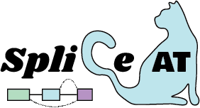
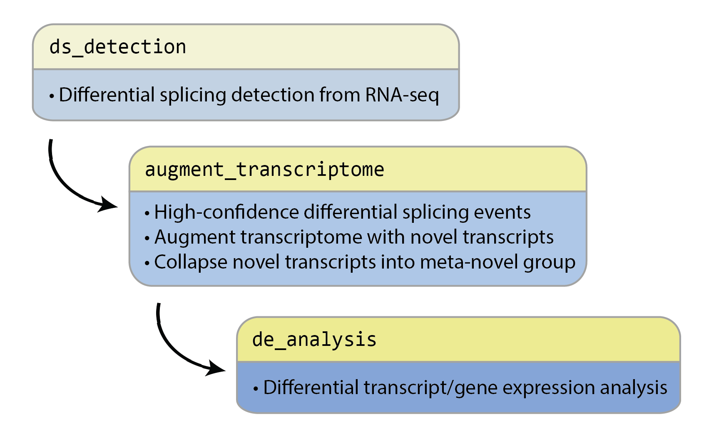

<p align="center">
  
</p>

# SpliCeAT: Integrated pipeline for detection and quantification of aberrant transcripts with novel splicing events

This repository contains the following Snakemake pipelines and scripts [^1], to be run in this order:
1. Differential splicing detection (`ds_detection`)
2. Generation of augmented transcriptome (`augment_transcriptome`)
3. Differential expression analysis (`de_analysis`)

<p align="center">
  
</p>

### What you need *before* starting:
- FASTQ sample files of 2 conditions (control & treatment)
- Aligned BAM files using STAR
- Gene annotation (GTF/GFF3) in GENCODE format

Download the respective gene annotations and genome files for the species of interest and place them into a location of your choice:

- A `GFF3` gene annotation file  (e.g. `gencode.vM29.primary_assembly.annotation.gff3`).  Unzip the file using `gunzip` tool.
- A `GTF` gene annotation file (e.g. `gencode.vM29.primary_assembly.annotation.gtf.gz`).
- A `FASTA` genome file (e.g. `GRCm39.primary_assembly.genome.fa.gz`).

You may obtain the annotation files from Gencode ([mouse](https://www.gencodegenes.org/mouse/)).

### Start here: 
```
git clone https://github.com/ys-lim/SpliCeAT.git
```

[^1]: The pipelines expect RNA-seq alignments/BAM files to be labelled as `sample_Aligned.sortedByCoord.out.bam` (as in STAR output format). Nevertheless, modifications can be made (at the user's discretion) in the Snakemake `rules` to account for alignments generated by other tools (e.g. HISAT2). 
