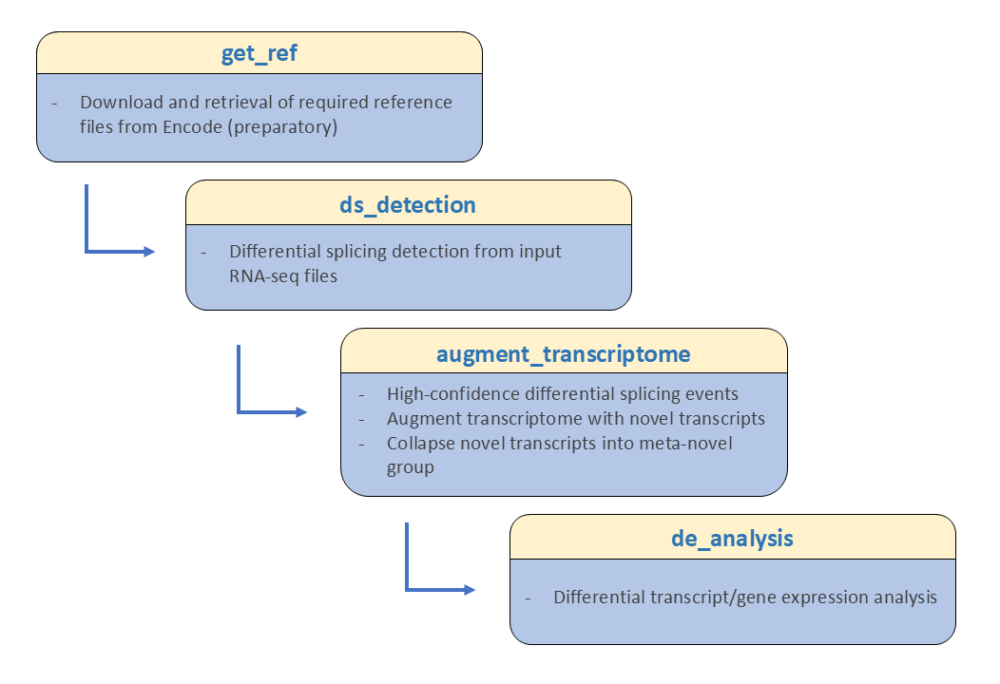

<p align="center">
  
</p>

# SpliCeAT: Integrated pipeline for detection and quantification of aberrant transcripts with novel splicing events

This repository contains the following Snakemake pipelines and scripts, to be run in this order:
1. Preparatory Step (`00_get_ref`) [^1]
2. Differential splicing detection (`01_ds_detection`)
3. Generation of augmented transcriptome (`02_augment_transcriptome`)
4. Differential expression analysis (`03_de_analysis`)

<p align="center">
  
</p>

### Pipeline Structure
```
SpliCeAT/
├── config/
├── workflow/
│   ├── common_rules/
│   ├── envs/
│   └── modules/
│       ├── Snakefile (-> pending)
│       ├── 00_get_ref/
│       │   ├── workflow
│       │   │   ├── Snakefile
│       │   │   ├── rules/
│       │   │   └── scripts/
│       │   └── logs
│       ├── 01_ds_detection/
│       │   ├── workflow/
│       │   │   ├── Snakefile
│       │   │   ├── rules/
│       │   │   └── scripts/
│       │   └── logs/
│       ├── 02_augment_transcriptome/
│       │   ├── workflow/
│       │   │   ├── Snakefile
│       │   │   ├── rules/
│       │   │   └── scripts/
│       │   └── logs/
│       └── 03_de_analysis/
│           ├── workflow/
│           │   ├── Snakefile
│           │   ├── rules/
│           │   └── scripts/
│           └── logs/
└── results/
    ├── samples.tsv
    ├── r0_get_ref/
    ├── r1_ds_detection/
    ├── r2_augment_transcriptome/
    └── r3_de_analysis/
```

Each module can be run seperately from its specific folder. The snakemake files are designed to run from outside the corresponding workflow directories to avoid path conflicts.

### What you need *before* starting:
- FASTQ sample files of 2 conditions (control & treatment), preprocessed [^2]
- BAM files aligned to Ensembl references using STAR, indexed using samtools [^3]

## Start here:
### Download repo
```
git clone -b restructure https://github.com/meg-hz/SpliCeAT.git
```

###  Experiment Design File
- Place your `design.tsv` in the `config` directory
- Each sample must specify the paired fastq files
- If alignment has been done prior to running the pipeline (`STAR activate: False`), then an additional column (`bam_files`) must be present containing paths of the resultant alignment files [^4]
- The pipeline supports pairwise comparison, so the `group` column should specify two groups (e.g., control and treatment).
An example experiment design file is in `config/design.tsv`

| sample_name | group   | fq1                         | fq2                         | bam_file                               |
| ----------- | ------- | --------------------------- | --------------------------- | -------------------------------------- |
| CTX_104     | treated | /path_to_fq/CTX_104_1.fq.gz | /path_to_fq/CTX_104_2.fq.gz | /path_to_bam/CTX_104.sortedByCoord.bam |
| CTX_108     | treated | /path_to_fq/CTX_108_1.fq.gz | /path_to_fq/CTX_108_2.fq.gz | /path_to_bam/CTX_108.sortedByCoord.bam |
| CTX_120     | control | /path_to_fq/CTX_120_1.fq.gz | /path_to_fq/CTX_120_2.fq.gz | /path_to_bam/CTX_120.sortedByCoord.bam |
| CTX_125     | control | /path_to_fq/CTX_125_1.fq.gz | /path_to_fq/CTX_125_2.fq.gz | /path_to_bam/CTX_125.sortedByCoord.bam |
| CTX_128     | treated | /path_to_fq/CTX_128_1.fq.gz | /path_to_fq/CTX_128_2.fq.gz | /path_to_bam/CTX_128.sortedByCoord.bam |
| CTX_147     | control | /path_to_fq/CTX_147_1.fq.gz | /path_to_fq/CTX_147_2.fq.gz | /path_to_bam/CTX_147.sortedByCoord.bam |
| CTX_148     | control | /path_to_fq/CTX_148_1.fq.gz | /path_to_fq/CTX_148_2.fq.gz | /path_to_bam/CTX_148.sortedByCoord.bam |
| CTX_154     | treated | /path_to_fq/CTX_154_1.fq.gz | /path_to_fq/CTX_154_2.fq.gz | /path_to_bam/CTX_154.sortedByCoord.bam |


### Configuration File
- An example configuration file is provided in the `config/config.yaml`.
- Each of the underlying tools can be skipped by specifying `activate: False`.
- The absolute path of the pipeline must be specified by the user
- In order to run majiq you must provide the location of a **valid majiq license file**
- The absolute path of the results directory can be specified by the user, if no input is provided, results will be stored in the pipeline directory.

### Run Snakemake Pipeline 

The workflow is configured to use conda, which should download and configure all of the needed environments. If you are using Snakemake > 4.8.0, then you can run the workflow in a combination of conda and conainers as described in [Ad-hoc combination of Conda package management with containers](https://snakemake.readthedocs.io/en/stable/snakefiles/deployment.html#ad-hoc-combination-of-conda-package-management-with-containers)

Execute a Snakemake dry run with

```bash
snakemake -np
```

to check the parameters of the run. Once ready to run, execute

```bash
snakemake --use-conda --cores 24
```

---

[^1]: This step isn't required if user is providing their own reference files. This would require modifications to be made (at the user's discretion) to the Snakemake rules that require the corresponding references.

[^2]: Majiq will throw errors if ambiguous bases are present in the BAM or Fasta files. Appropriate trimming and filtering might need to be performed using [Trimmomatic](http://www.usadellab.org/cms/?page=trimmomatic) or [Fastp](https://github.com/OpenGene/fastp) prior to running this pipeline.

[^3]: The required BAM files can be generated by the preparatory module by setting `STAR activate:` to `True` and running the preparatory step.

[^4]: The pipelines expect RNA-seq alignments/BAM files to be labelled as `sample_Aligned.sortedByCoord.out.bam` (STAR output format). Nevertheless, modifications can be made (at the user's discretion) in the Snakemake rules to account for alignments generated by other tools (e.g. HISAT2). Also note that the corresponding indexed file (`sample_Aligned.sortedByCoord.out.bam.bai`) must also be present in the same folder as the bam files.
