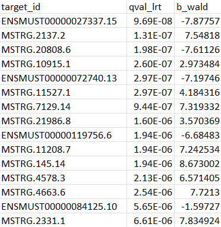
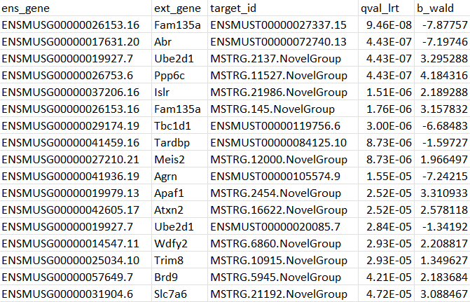

# Differential expression analysis

**Use:** Performs differential transcript expression analysis using augmented transcriptome (generated in previous [step](https://github.com/ys-lim/SpliCeAT/tree/main/augment_transcriptome))

**Input:** kallisto index of the augmented transcriptome & sample FASTQ files

**Output:** List of differentially expressed transcripts (for both uncollapsed and collapsed transcripts versions)

## Packages required
Click on the links for installation instructions. (In brackets are versions used when run by the author)
- [kallisto](https://pachterlab.github.io/kallisto/download) (0.46.1)

R packages:
- [biomaRt](https://bioconductor.org/packages/release/bioc/html/biomaRt.html) (2.54.0)
- [lgr](https://cran.r-project.org/web/packages/lgr/index.html) (0.4.4)
- [rhdf5](https://bioconductor.org/packages/release/bioc/html/rhdf5.html) (2.42.0)
- [yaml](https://www.rdocumentation.org/packages/yaml/versions/2.3.7) (2.3)
- [tidyverse](https://tidyverse.tidyverse.org/) (1.3.2)
- [sleuth](http://pachterlab.github.io/sleuth/download) (0.30.1)

## Required input
The `ds_detection` and `augment_transcriptome` steps should have been run and the following output files (located in `SpliCeAT/augment_transcriptome/`) will be used in this step: 
```
results
└── augmented_transcriptome
    ├── kallisto_index_augmented_transcriptome
    ├── t2g_augment_collapsed.csv
    └── t2g_augment_uncollapsed.csv
```
The subsequent analysis will be carried out in 2 parts: (1) Quantification of transcripts against the augmented transcriptome, and (2) Differential transcript expression analysis. 

## Setting up
1. Open the `samples.tsv` and `experimental_design.tsv` in the `config` folder and change to your sample names, paths and conditions accordingly. The fastqdir is a directory containing all FASTQ files in your experiment. It is important to adhere to the column names:

`samples.tsv`:
|sample_name|fastq1|fastq2|fastqdir|
|:----|:----|:----|:----|
|CTX_120|CTX_120_1.fq.gz|CTX_120_2.fq.gz|/mnt/gtklab01/linglab/tdp43/fastq/|
|CTX_125|CTX_125_1.fq.gz|CTX_125_2.fq.gz|/mnt/gtklab01/linglab/tdp43/fastq/|
|CTX_147|CTX_147_1.fq.gz|CTX_147_2.fq.gz|/mnt/gtklab01/linglab/tdp43/fastq/|
|CTX_148|CTX_148_1.fq.gz|CTX_148_2.fq.gz|/mnt/gtklab01/linglab/tdp43/fastq/|
|CTX_104|CTX_104_1.fq.gz|CTX_104_2.fq.gz|/mnt/gtklab01/linglab/tdp43/fastq/|
|CTX_108|CTX_108_1.fq.gz|CTX_108_2.fq.gz|/mnt/gtklab01/linglab/tdp43/fastq/|
|CTX_128|CTX_128_1.fq.gz|CTX_128_2.fq.gz|/mnt/gtklab01/linglab/tdp43/fastq/|
|CTX_154|CTX_154_1.fq.gz|CTX_154_2.fq.gz|/mnt/gtklab01/linglab/tdp43/fastq/|

`experimental_design.tsv`:
|sample|gender|condition|
|:----|:----|:----|
|CTX_120|M|ctr|
|CTX_125|M|ctr|
|CTX_147|F|ctr|
|CTX_148|F|ctr|
|CTX_104|M|trtment|
|CTX_108|F|trtment|
|CTX_128|M|trtment|
|CTX_154|F|trtment|

2. Open `config.yaml` and change the following paths:
```
BASE_PATH: /mnt/cbis/home/yongshan/SpliCeAT
STRAND: "rf-stranded"
BOOTSTRAPS: 100
N_THREADS: 4
```

3. Open up `sleuth.R` in the `scripts` folder & the `Snakefile` in `workflow` and change the first line to point to your config file location:

`sleuth.R`:
```
#### CHANGE THIS ####
config_file_path <- "/mnt/cbis/home/yongshan/SpliCeAT/de_analysis/config/config.yaml"
####################
...
```
`Snakefile`:
```
configfile: "/mnt/cbis/home/yongshan/SpliCeAT/de_analysis/config/config.yaml"
...
```

## Running Snakemake
Once the above files are configured correctly, execute a Snakemake dry run with
```
snakemake -np
```
to check the parameters of the run. Once ready to run, execute
```
snakemake --cores 12
```

## Output files
You should see the following files in the `results` folder:
```
results
├── kallisto_quant_out
│   ├── <sample1>
│   │   ├── abundance.h5
│   │   ├── abundance.tsv
│   │   └── run_info.json
│   ├── <sample2>
│   │   ├── abundance.h5
│   │   ├── abundance.tsv
│   │   └── run_info.json
│   ├── <sample3>
│   │   ├── abundance.h5
│   │   ├── abundance.tsv
│   │   └── run_info.json
│   ├── <sample4>
│   │   ├── abundance.h5
│   │   ├── abundance.tsv
│   │   └── run_info.json
│   ├── <sample5>
│   │   ├── abundance.h5
│   │   ├── abundance.tsv
│   │   └── run_info.json
│   ├── <sample6>
│   │   ├── abundance.h5
│   │   ├── abundance.tsv
│   │   └── run_info.json
│   ├── <sample7>
│   │   ├── abundance.h5
│   │   ├── abundance.tsv
│   │   └── run_info.json
│   └── <sample8>
│       ├── abundance.h5
│       ├── abundance.tsv
│       └── run_info.json
└── sleuth
    ├── collapsed_differential_transcript_analysis.csv
    ├── collapsed_differential_transcript_analysis_tpm.csv
    ├── uncollapsed_differential_transcript_analysis.csv
    └── uncollapsed_differential_transcript_analysis_tpm.csv
```
The differential transcript expression analysis results are found in `collapsed_differential_transcript_analysis.csv` and `uncollapsed_differential_transcript_analysis.csv`. 

Normal differential transcript expression without collapsing:
<p align="left">
  
</p>

Results after collapsing transcripts:
<p align="left">
  
</p>

