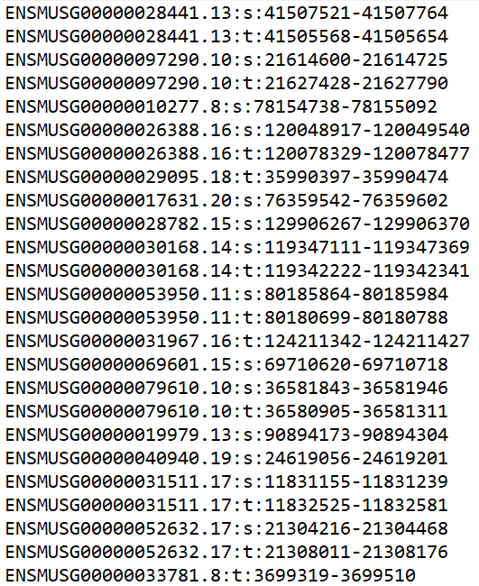

# Differential splicing detection

## Necessary packages/tools
- python
- R
- julia
- majiq/voila
- leafcutter (both leafcutter scripts & R package)
- whippet
- snakemake
- samtools
- regtools
- (R package) optparse
- (R package) data.table
- (R package) dplyr

### Leafcutter installation
Github installation: For leafcutter quantifications (junction counts for each splicing cluster), you will require the python scripts in `scripts` and `clustering` directories of the leafcutter github:
```
git clone https://github.com/davidaknowles/leafcutter
```
R package installation: For differential splicing analysis, the leafcutter R package is required:
```
devtools::install_github("davidaknowles/leafcutter/leafcutter")
```
Further detailed installation instructions can be found [here](https://davidaknowles.github.io/leafcutter/articles/Installation.html).

## Setting up

1. Upload your `design.csv` in the `input` directory as follows:

`design.csv` : experimental design (change to your own, with the following compulsory columns)

| sample      | design    | genome | strand  | fq1             | fq2             |
|-------------|-----------|--------|---------|-----------------|-----------------|
| CTX_120 | control   | mm39   | reverse | CTX_120_1.fq.gz | CTX_120_2.fq.gz |
| CTX_125     | control   | mm39   | reverse | CTX_125_1.fq.gz | CTX_125_2.fq.gz |
| CTX_147     | control   | mm39   | reverse | CTX_147_1.fq.gz | CTX_147_2.fq.gz |
| CTX_148     | control   | mm39   | reverse | CTX_148_1.fq.gz | CTX_148_2.fq.gz |
| CTX_104 | treatment | mm39   | reverse | CTX_104_1.fq.gz | CTX_104_2.fq.gz |
| CTX_108     | treatment | mm39   | reverse | CTX_108_1.fq.gz | CTX_108_2.fq.gz |
| CTX_128     | treatment | mm39   | reverse | CTX_128_1.fq.gz | CTX_128_2.fq.gz |
| CTX_154     | treatment | mm39   | reverse | CTX_154_1.fq.gz | CTX_154_2.fq.gz |

2. Download the respective gene annotations and genome files for the species of interest and place them into a location of your choice:

- A `GFF3` gene annotation file  (e.g. `gencode.vM29.primary_assembly.annotation.gff3`).  Unzip the file using `gunzip` tool.
- A `GTF` gene annotation file (e.g. `gencode.vM29.primary_assembly.annotation.gtf.gz`).
- A `FASTA` genome file (e.g. `GRCm39.primary_assembly.genome.fa.gz`).

You may obtain the annotation files from Gencode ([mouse](https://www.gencodegenes.org/mouse/), [human](https://www.gencodegenes.org/human/)).

3. Open the `prep.R` file and change the following parameters to suit your experimental design:

```
# differential splicing detection directory
setwd("/mnt/cbis/home/yongshan/SpliCeAT/ds_detection") 

# experimental design csv file - dont need to change if design.csv is in input directory
design <- read.csv("./input/design.csv") 

# directory containing your bam alignment files
bam_dir <- "/mnt/gtklab01/linglab/tdp43/STAR/tdp43_nestin_ctx_e14/" 

 # directory containing your fastq files
fq_dir <- "/mnt/gtklab01/linglab/tdp43/fastq/"

# set your own experiment name
experiment_name <- "tdp43_nestin_ctx_e14" 

# path of annotation gff3 file
gff3_path <- "/mnt/gtklab01/linglab/mmusculus_annotation_files/gencode.vM29.primary_assembly.annotation.gff3" 

# path of annotation gtf.gz file
annotation_gtf_path <- "/mnt/gtklab01/linglab/mmusculus_annotation_files/gencode.vM29.primary_assembly.annotation.gtf.gz" 

# path of genome fa.gz file
fasta_file_path <- "/mnt/gtklab01/linglab/mmusculus_annotation_files/GRCm39.primary_assembly.genome.fa.gz" 

# path of julia command
julia <- "/mnt/cbis/home/yongshan/julia-1.7.2/bin/julia" 

# directory of whippet scripts
whippet_bin <- "/mnt/cbis/home/yongshan/Whippet.jl/bin/" 

# Note that: 0 = unstranded, 1 = first-strand/RF, 2, = second-strand/FR
regtools_strand <- "1" 

# directory of leafcutter installation
leafcutter_dir <- "/mnt/cbis/home/yongshan/leafcutter/" 
```

4. Open the `Snakefile` in `workflow` and change the first line to point to your config file location:
```
 configfile: "<your_ds_detection_snakemake_dir>/config/config.yaml"
 ...
 ```

5. Run `prep.R` on command line with
```
Rscript prep.R
```
in order to populate the directories with the necessary helper files. The following 14 files should be successfully created within the `config/` directory:
- `config.yaml`

### Majiq helper files
- `<experiment_name>_conf.txt`
- `confs.tsv`
- `delta_psi_samples.tsv`
- `experiment_sample_names.tsv`

### Whippet helper files
- `delta.tsv`
- `delta_input.tsv`
- `fastq.tsv`
- `samples_whippet.tsv`

### Leafcutter helper files
- `juncs_file.tsv`
- `output_junc.tsv`
- `samples_leafcutter.tsv`
- `<experiment_name>_groups_file.txt`
- `<experiment_name>_groups_junc.txt`

## Running Snakemake
Once the above finishes running successfully and the necessary helper files are created, execute a Snakemake dry run with
```
snakemake -np
```
to check the parameters of the run. Once ready to run, execute
```
snakemake --cores 24
```

## Output files
In the `results` directory, you should see the following output files:

### Majiq output files
In directory `results/majiq_build`:
- `<sample>.majiq`
- `<sample>.sj`
- `majiq.log`
- `splicegraph.sql`

In directory `results/majiq_delta_psi`:
- `ctr-treatment.deltapsi.tsv`
- `ctr-treatment.deltapsi.voila`
- `deltapsi_majiq.log`

In order to view the interactive results on Voila web server, execute the following on command line (from your top-level ds_detection Snakemake directory):
```
voila view results/majiq_delta_psi/<experiment_name>/ctr-treatment.deltapsi.voila results/majiq_build/<experiment_name>/splicegraph.sql -p 5000 --host 0.0.0.0
```
View the results on `http://<remote_server>:5000/` (e.g. `http://atlas.cbis.nus.edu.sg:5000/`) and they should be displayed as follows. Click on `Download LSVs` to get the list of local splicing variations. 

<p align="left">
  
</p>

Local splicing variations (LSV) file:
<p align="left">
  
</p>


### Whippet output files
In directory `results/index`:
- `<experiment_name>.jls`
- `<experiment_name>.jls.exons.tab.gz`

In directory `results/quantify`:

For each sample,
- `<sample>.gene.tpm.gz`
- `<sample>.isoform.tpm.gz`
- `<sample>.jnc.gz`
- `<sample>.map.gz`
- `<sample>.psi.gz`

In directory `results/delta_psi`:
- `<experiment_name>.diff.gz`

All alternative splicing results are found in the `results/delta_psi/<experiment_name>.diff.gz` file. Unzip the file on command line as follows:
```
gunzip <experiment_name>.diff.gz
```
and the results should look something like this:
<p align="left">
  
</p>

### Leafcutter output files

In the `results` directory, you should see the following output files:
- `<experiment_name>_cluster_significance.txt`
- `<experiment_name>_effect_sizes.txt`

All alternative splicing results are found in the above 2 files. 
`<experiment_name>_cluster_significance.txt` (significance of AS events):

<p align="left">
  
</p>

`<experiment_name>_effect_sizes.txt` (deltaPSI of AS events):
<p align="left">
  
</p>

## Next steps
If all output files were created successfully, proceed to `augment_transcriptome` ([link](https://github.com/ys-lim/SpliCeAT/tree/main/augment_transcriptome)) to augment the reference transcriptome with these differential splicing events.

## Other useful tools
- [Majiq command builder](https://biociphers.bitbucket.io/majiq-docs-academic/commandbuilder.html)
- [Leafcutter vignette](https://davidaknowles.github.io/leafcutter/articles/Usage.html)
