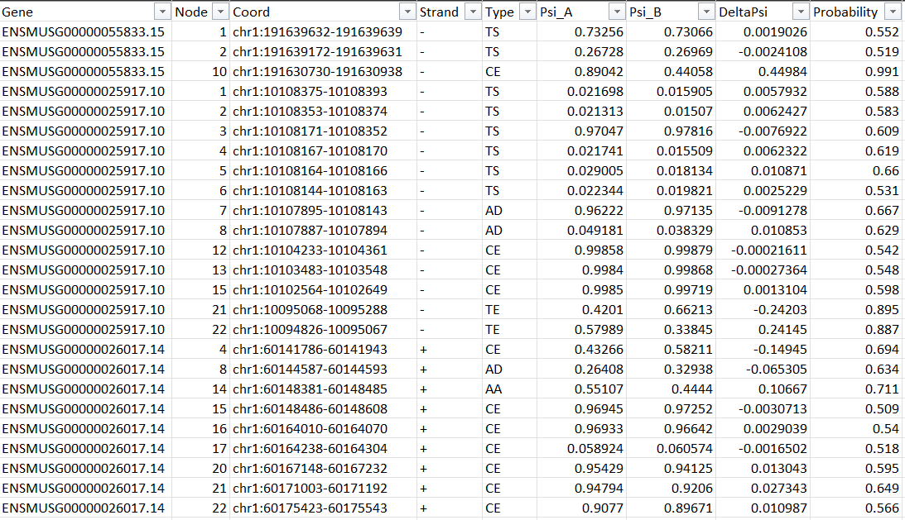

# Differential splicing detection

**Use:** Performs differential splicing detection (using Majiq, Whippet & Leafcutter) between control & treatment RNA-seq samples
**Input:** Aligned and indexed RNA-seq BAM files, along with fastq files for each BAM file
**Output:** List of differential splicing events between control & treatment

## Input Parameters
### Experiment Design File 
- Place your `design.tsv` in the `input` directory 
- Each sample must specify the BAM file and paired fastq files
- The pipeline supports pairwise comparison, so the `group` column should specify two groups (e.g., control and treatment).
An example experiment design file is in `input/design.tsv`

| sample_name | group   | bam_file                               | fq1                         | fq2                         |
| ----------- | ------- | -------------------------------------- | --------------------------- | --------------------------- |
| CTX_104     | treated | /path_to_bam/CTX_104.sortedByCoord.bam | /path_to_fq/CTX_104_1.fq.gz | /path_to_fq/CTX_104_2.fq.gz |
| CTX_108     | treated | /path_to_bam/CTX_108.sortedByCoord.bam | /path_to_fq/CTX_108_1.fq.gz | /path_to_fq/CTX_108_2.fq.gz |
| CTX_120     | control | /path_to_bam/CTX_120.sortedByCoord.bam | /path_to_fq/CTX_120_1.fq.gz | /path_to_fq/CTX_120_2.fq.gz |
| CTX_125     | control | /path_to_bam/CTX_125.sortedByCoord.bam | /path_to_fq/CTX_125_1.fq.gz | /path_to_fq/CTX_125_2.fq.gz |
| CTX_128     | treated | /path_to_bam/CTX_128.sortedByCoord.bam | /path_to_fq/CTX_128_1.fq.gz | /path_to_fq/CTX_128_2.fq.gz |
| CTX_147     | control | /path_to_bam/CTX_147.sortedByCoord.bam | /path_to_fq/CTX_147_1.fq.gz | /path_to_fq/CTX_147_2.fq.gz |
| CTX_148     | control | /path_to_bam/CTX_148.sortedByCoord.bam | /path_to_fq/CTX_148_1.fq.gz | /path_to_fq/CTX_148_2.fq.gz |
| CTX_154     | treated | /path_to_bam/CTX_154.sortedByCoord.bam | /path_to_fq/CTX_154_1.fq.gz | /path_to_fq/CTX_154_2.fq.gz |

- **Important Note**: Majiq will throw errors if ambiguous bases are present in the BAM or Fasta files. Appropriate trimming and filtering might need to be performed using [Trimmomatic](http://www.usadellab.org/cms/?page=trimmomatic) or [Fastp](https://github.com/OpenGene/fastp) prior to running this pipeline

### Configuration File
- An example configuration file is provided in the `config/config.yaml`. Each of the underlying tools can be skipped by specifying `activate: False`. 
- In order to run majiq you must provide the location of a **valid majiq license file**

## Recommended Use: with conda

The workflow is configured to use conda, which should download and configure all of the needed environments. If you are using Snakemake > 4.8.0, then you can run the workflow in a combination of conda and conainers as described in [Ad-hoc combination of Conda package management with containers](https://snakemake.readthedocs.io/en/stable/snakefiles/deployment.html#ad-hoc-combination-of-conda-package-management-with-containers)

Execute a Snakemake dry run with

```bash
snakemake -np
```

to check the parameters of the run. Once ready to run, execute

```bash
snakemake --use-conda --cores 24
```

---
## Not recommended: running locally

### Packages Required 
Links contain installation instructions. In brackets are versions used by the author
- [python](https://www.python.org/downloads/) (3.9.16)
- [R](https://cran.rstudio.com/) (4.2.2)
- [julia](https://julialang.org/downloads/) (1.7.2, Whippet only works with julia version < 1.9)
- [majiq/voila](https://majiq.biociphers.org/app_download/) (2.4.dev3+g85d07819)
- [whippet](https://github.com/timbitz/Whippet.jl#1-install) (1.6.1)
- [snakemake](https://snakemake.readthedocs.io/en/stable/getting_started/installation.html) (6.8.1)
- [samtools](http://www.htslib.org/download/) (1.13)
- [regtools](https://github.com/griffithlab/regtools#installation) (0.5.2)

**R packages:**
- [optparse](https://cran.r-project.org/web/packages/optparse/readme/README.html) (1.7.3)
- [data.table](https://github.com/Rdatatable/data.table#installation) (1.14.6)
- [dplyr](https://www.r-project.org/nosvn/pandoc/dplyr.html) (1.1.0)
- [leafcutter](https://davidaknowles.github.io/leafcutter/articles/Installation.html) (both leafcutter scripts & R package) (R pckg version: 0.2.9)

**Python packages:**
- [pandas](https://pandas.pydata.org/docs/getting_started/install.html) (1.5.0)

Once installed, execute a Snakemake dry run with

```bash
snakemake -np
```

and execute the pipeline with

```bash
snakemake --cores 24
```


## Output files
In the `results` directory, you should see the following output files:

```
results
├── leafcutter/
│   ├── cluster_significance.txt 
│   ├── effect_sizes.txt 
│   ├── exons.txt.gz
│   ├── groups.tsv
│   ├── leafcutter_lsvs.tsv
│   ├── leafcutter_perind_numers.counts.gz
│   ├── leafcutter_perind.counts.gz  
│   ├── leafcutter_pooled 
│   ├── leafcutter_refined 
│   ├── leafcutter_sortedlibs 
│   └── <sample>.junc.leafcutter.sorted.gz
├── majiq/
│   ├── control-treated.deltapsi.voila
│   ├── control-treated.het.tsv
│   ├── control-treated.het.voila
│   ├── expanded_control-treated.deltapsi.tsv
│   ├── majiq.ini 
│   └── splicegraph.sql
├── ref 
│   ├── <reference>_chr_filtered.gff3           
│   └── <reference>_chr_filtered.gtf.gz         
├── regtools
│   └── <sample>.junc ##for all samples
└── whippet/
    ├── quant/
    │   ├── <sample>.gene.tpm.gz
    │   ├── <sample>.isoform.tpm.gz        
    │   ├── <sample>.jnc.gz          
    │   ├── <sample>.map.gz
    │   └── <sample>.psi.gz
    ├── delta_psi.diff.gz
    ├── merged.bam
    ├── merged.bam.bai 
    ├── whippet_index.jls  
    └── whippet_index.jls.exons.tab.gz 
```

### Majiq Output
In order to view the interactive results on Voila web server, execute the following on command line (from your top-level ds_detection Snakemake directory):
```
voila view results/majiq_delta_psi/<experiment_name>/ctr-treatment.deltapsi.voila results/majiq_build/<experiment_name>/splicegraph.sql -p 5000 --host 0.0.0.0
```
View the results on `http://<remote_server>:5000/` (e.g. `http://atlas.cbis.nus.edu.sg:5000/`) and they should be displayed as follows. Click on `Download LSVs` to get the list of local splicing variations. 

<p align="left">
  
</p>

Local splicing variations (LSV) file:
<p align="left">
  
</p>


### Whippet output files
All alternative splicing results are found in the `results/delta_psi.diff.gz` file. Unzip the file on command line as follows:
```
gunzip delta_psi.diff.gz
```
and the results should look like this, where each row is a differential splicing event:
<p align="left">
  
</p>

### Leafcutter output files

In the `results` directory, you should see the following output files:
- `<experiment_name>_cluster_significance.txt`
- `<experiment_name>_effect_sizes.txt`
All alternative splicing results are found in the above 2 files. 

`<experiment_name>_cluster_significance.txt` (significance of AS events):

<p align="left">
  
</p>

`<experiment_name>_effect_sizes.txt` (deltaPSI of AS events):
<p align="left">
  
</p>

---
## Next steps
If all output files were created successfully, proceed to `augment_transcriptome` ([link](https://github.com/ys-lim/SpliCeAT/tree/main/augment_transcriptome)) to augment the reference transcriptome with these differential splicing events.

## Other useful tools
- [Majiq command builder](https://biociphers.bitbucket.io/majiq-docs-academic/commandbuilder.html)
- [Leafcutter vignette](https://davidaknowles.github.io/leafcutter/articles/Usage.html)
