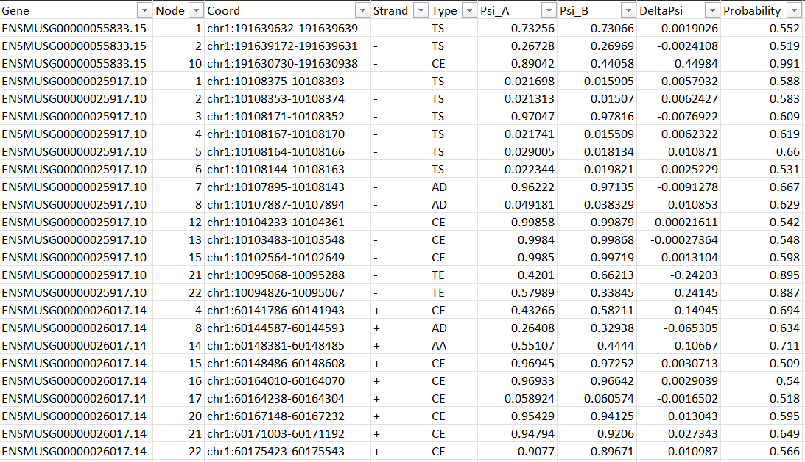

# Whippet snakemake

## Necessary packages/tools
- julia
- whippet
- samtools
- dplyr

## Setting up
1. Upload the `design.csv` experimental design file into the `input` directory as follows:

| sample | fq1    | fq2 | design  |
| ------ | ------  | ------ | ------  |
| F2014	 | F2014_R1.fastq.gz	 | F2014_R2.fastq.gz	  | control |
| F2011	 | F2011_R1.fastq.gz	 | F2011_R2.fastq.gz	  | control |
| F2003	 | F2003_R1.fastq.gz	 | F2003_R2.fastq.gz	  | control |
| F2001	 | F2001_R1.fastq.gz | F2001_R2.fastq.gz	  | treatment |
| F2010	 | F2010_R1.fastq.gz | F2010_R2.fastq.gz	  | treatment |
| F2002	 | F2002_R1.fastq.gz | F2002_R2.fastq.gz	  | treatment |

2. Open the `prep.R` file and change the following parameters to suit your experimental design:
```
setwd("/mnt/cbis/home/yongshan/whippet_snakemake") # whippet snakemake directory
fasta_file_path <- "/mnt/gtklab01/linglab/mmusculus_annotation_files/GRCm39.primary_assembly.genome.fa.gz" # location of genome fa.gz file
annotation_gtf_path <- "/mnt/gtklab01/linglab/mmusculus_annotation_files/gencode.vM29.primary_assembly.annotation.gtf.gz" # location of annotation gtf.gz file
experiment_name <- "WT_IgG2A_WT_O9_CTX" # set your own experiment name
design <- read.csv("./input/design.csv") # experimental design csv file
fq_dir <- "/mnt/gtklab01/linglab/external_datasets/tdp43_Q331K_rescue_rubychen/trimmedFASTQ/" # directory with fastq files
bam_dir <- "/mnt/gtklab01/linglab/external_datasets/tdp43_Q331K_rescue_rubychen/STAR/" # directory with bam files
julia <- "/mnt/cbis/home/yongshan/julia-1.7.2/bin/julia" # location of julia command
whippet_bin <- "/mnt/cbis/home/yongshan/Whippet.jl/bin/" # directory of whippet scripts
```

3. Open the `Snakefile` in `workflow` and change the first line to point to your config file location:
```
 configfile: "<your_snakemake_dir>/config/config.yaml"
 ...
```

4. Run `prep.R` on command line with
```
Rscript prep.R
```
in order to populate the directories with the necessary helper files. The following files should be successfully created:
- `config/config.yaml`
- `config/delta.tsv`
- `config/delta_input.tsv`
- `config/fastq.tsv`
- `config/samples.tsv`

## Running Snakemake

Once the above finishes running successfully and the necessary helper files are created, execute a Snakemake dry run with
```
snakemake -np
```
to check the parameters of the run. Once ready to run, execute
```
snakemake --cores 24
```

## Output files

In the `results` directory, you should see the following output files:

In directory `results/index`:
- `<experiment_name>.jls`
- `<experiment_name>.jls.exons.tab.gz`

In directory `results/quantify`:

For each sample,
- `<sample>.gene.tpm.gz`
- `<sample>.isoform.tpm.gz`
- `<sample>.jnc.gz`
- `<sample>.map.gz`
- `<sample>.psi.gz`

In directory `results/delta_psi`:
- `<experiment_name>.diff.gz`

All alternative splicing results are found in the `results/delta_psi/<experiment_name>.diff.gz` file. Unzip the file on command line as follows:
```
gunzip results/delta_psi/<experiment_name>.diff.gz
```
<p align="left">
  
</p>
